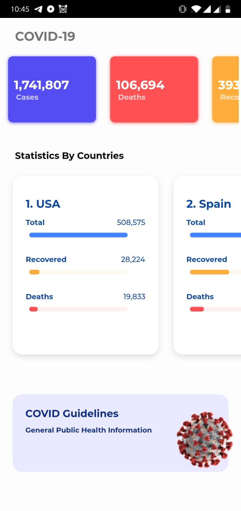
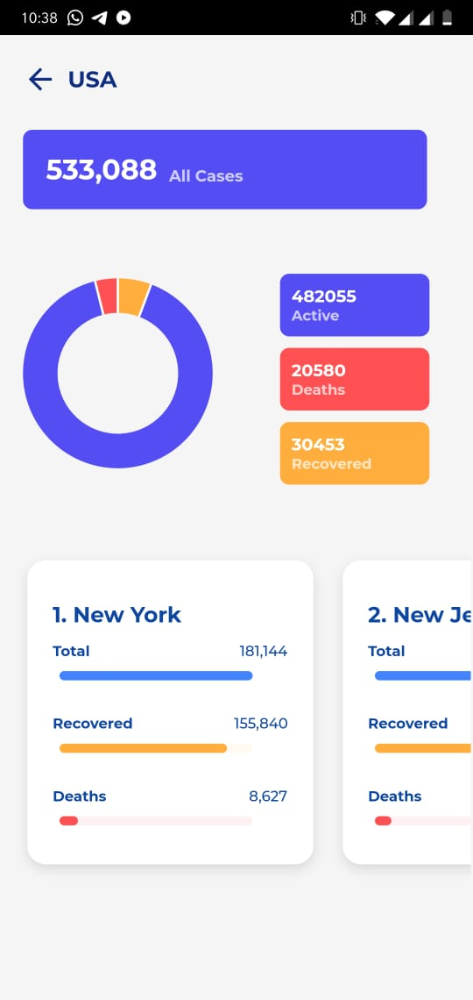
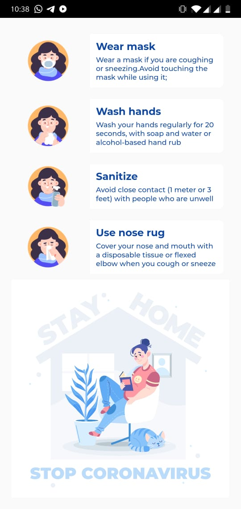

# Cotrack : The Covid-19 Tracker








A Coronavirus Tracker Application Written in flutter and Python(Flask).

## Introduction
This is a fairly simple project i started for learing. It tells statistics about the COVID-19 Cases details country wise. 

## Installation
Clone the repo and run 
```sh 
flutter get
``` 
to get the exteranal dependencies.

For backend `cd` into the `backend` folder and install python virtual environemnt
```sh 
virtualenv flaskenv
```
```sh
pip install -r requirements.txt
```

## How to run

Launch the flutter app with 
```sh 
flutter run
```

Run on emulator or change the URL in config to IP address for api access.

Launch the backend with
```sh 
python app.py
```


credits : 
Stay Home image - <a href="https://www.freepik.com/free-photos-vectors/home">Home vector created by freepik - www.freepik.com</a>